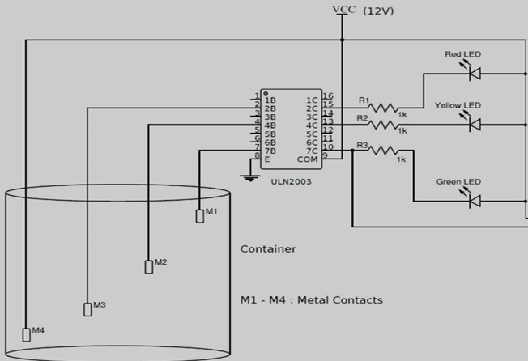
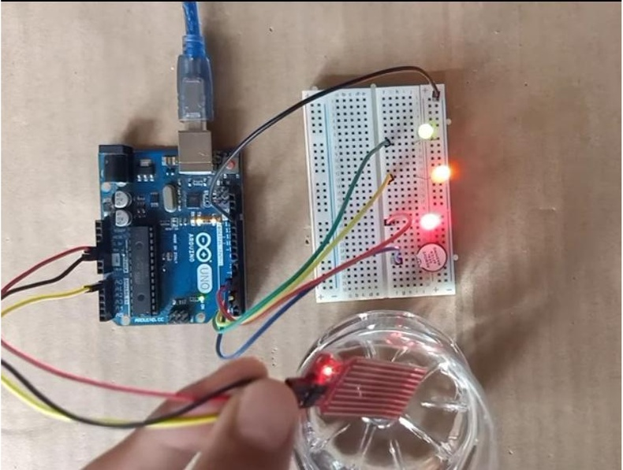

# Water Level Indicator System

An automated embedded systems prototype designed to monitor water levels in real-time, display live status via visual indicators, and trigger an auditory alarm when a liquid storage container reaches maximum capacity. This project helps prevent water wastage, minimizes energy costs, and eliminates the frustrations of manual storage monitoring.

## 👥 Project Team & Institutional Background
* **Institution:** Sharad Institute of Technology College of Engineering, Yadrav (An Autonomous Institute)
* **Department:** Electronics and Computer Engineering
* **Project Guide:** Miss. Purva Nikam & Mrs. Swati Halunde
* **Developed By:** Pooja Saraswat, Srushti Amar Patil, Sneha Bharmu Parpannavar, Snehal Hanmant Mali, Komal Madala Vitkar

## 🚀 Key Features & Industry Applications
* **Real-time Calibration:** Monitors automated threshold levels via continuous analog tracking.
* **Smart Power Optimization:** Minimizes energy and municipal water waste through precise automation.
* **Multi-Stage Alerts:** Features a 3-stage visual notification grid coupled with an automated emergency buzzer warning.
* **Industrial Usability:** Readily adaptable for industrial liquid storage tanks, chemical plants, and automotive fuel systems.

## 🛠️ System Architecture & Components
* **Microcontroller:** Arduino Uno (ATMega328P processing node)
* **Sensor Module:** Analog Resistive Water Level Sensor
* **Visual Interface:** High-brightness Red, Yellow, and Green LEDs (with 220-ohm current-limiting resistors)
* **Auditory Interface:** 5V Piezoelectric Buzzer Alarm
* **Prototyping Environment:** Solderless Breadboard & Solid-core jumper wires

## 📌 Pin Mapping & Hardware Connections
| Component | Device Connection Type | Arduino Pin Connection | Description |
| :--- | :--- | :--- | :--- |
| **Water Level Sensor** | Analog Input Signal (S) | **A0** | Sends real-time liquid level sensor data |
| **Water Level Sensor** | Power Supply (+) | **5V / VCC** | Module operational power |
| **Water Level Sensor** | Ground Supply (-) | **GND** | System common ground reference |
| **Red LED** | Digital Output Node | **Pin 13** | Low Water Level Indicator |
| **Yellow LED** | Digital Output Node | **Pin 12** | Half-Tank Level Indicator |
| **Green LED** | Digital Output Node | **Pin 11** | Full Tank Level Indicator |
| **Buzzer Alarm** | Digital Output Node | **Pin 10** | Critical Maximum Level Sound Warning |

---

## 📂 Project Documentation

For a detailed analysis of the sensor calibration, circuit logic, multi-level visual indicators, and hardware testing procedures, you can access the full official project report here:

> 📄 **[Click Here to Read the Full Project Report](./Project_Report.pdf)**

---

## 📊 Operational Methodology
The internal system firmware maps individual voltage variations to process specific structural logic flags:
1. **Empty State:** All system output LEDs remain completely offline when no water is detected.
2. **Low Level State:** The **Red LED** illuminates to indicate initial water baseline contact.
3. **Half-Full State:** The **Yellow LED** activates concurrently when water levels rise to the middle threshold.
4. **Maximum State:** The **Green LED** and **Buzzer Alarm** activate simultaneously to warn users that the tank is at max storage capacity.

 ## 📊 Circuit Schematic & Hardware Prototype
To give a comprehensive view of the system development, both the schematic logic using the ULN2003 driver array and the operational hardware prototype are presented below:

| System Circuit Schematic | Functional Physical Prototype |
| :---: | :---: |
|  |  |
